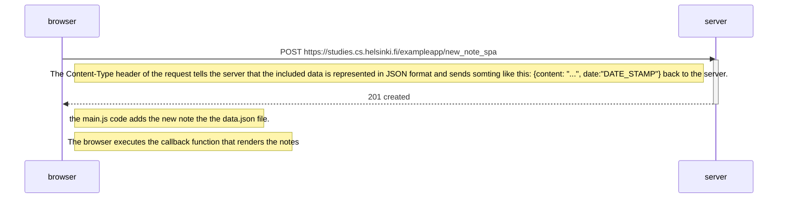

```mermaid
sequenceDiagram
    participant browser
    participant server

    browser->>server: POST https://studies.cs.helsinki.fi/exampleapp/new_note_spa
    activate server
    Note right of browser: The Content-Type header of the request tells the server that the included data is represented in JSON format and sends somting like this: {content: "...", date:"DATE_STAMP"} back to the server.
    server-->>browser: 201 created 
    deactivate server

    Note right of browser: the main.js code adds the new note the the data.json file.
    
    Note right of browser: The browser executes the callback function that renders the notes
```
